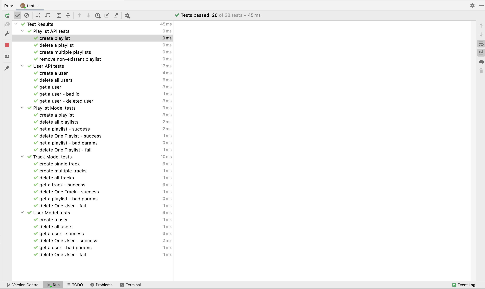

# Playlist Test Skeleton

In order to start building the test - we commence enhancing the playtimeService gateway to our api:

### playtime-service.js

~~~javascript
import axios from "axios";

import { serviceUrl } from "../fixtures.js";

export const playtimeService = {
  playtimeUrl: serviceUrl,

  async createUser(user) {
    const res = await axios.post(`${this.playtimeUrl}/api/users`, user);
    return res.data;
  },

  async getUser(id) {
    const res = await axios.get(`${this.playtimeUrl}/api/users/${id}`);
    return res.data;
  },

  async getAllUsers() {
    const res = await axios.get(`${this.playtimeUrl}/api/users`);
    return res.data;
  },

  async deleteAllUsers() {
    const res = await axios.delete(`${this.playtimeUrl}/api/users`);
    return res.data;
  },

  async createPlaylist(playlist) {
    const res = await axios.post(`${this.playtimeUrl}/api/playlists`, playlist);
    return res.data;
  },

  async deleteAllPlaylists() {
    const response = await axios.delete(`${this.playtimeUrl}/api/playlists`);
    return response.data;
  },

  async deletePlaylist(id) {
    const response = await axios.delete(`${this.playtimeUrl}/api/playlists/${id}`);
    return response;
  },

  async getAllPlaylists() {
    const res = await axios.get(`${this.playtimeUrl}/api/playlists`);
    return res.data;
  },

  async getPlaylist(id) {
    const res = await axios.get(`${this.playtimeUrl}/api/playlists/${id}`);
    return res.data;
  },
};
~~~

This has a new set of methods of accessing playlists, designed to operate against the routes defined in the last step

We can then establish a skeleton test set:

### playlist-api-test.js

~~~javascript
import { assert } from "chai";
import { playtimeService } from "./playtime-service.js";
import { assertSubset } from "../test-utils.js";

suite("Playlist API tests", () => {

  setup(async () => {
  });

  teardown(async () => {});

  test("create playlist", async () => {
  });

  test("delete a playlist", async () => {
  });

  test("create multiple playlists", async () => {
  });

  test("remove non-existant playlist", async () => {
  });
});
~~~

We should be in a position to run all tests now:

We are expecting all tests to pass - although the PlaylistAPI tests are, of course, currently just placeholders. However, with the test infrastructure in place we can commence the incremental development of each endpoint.